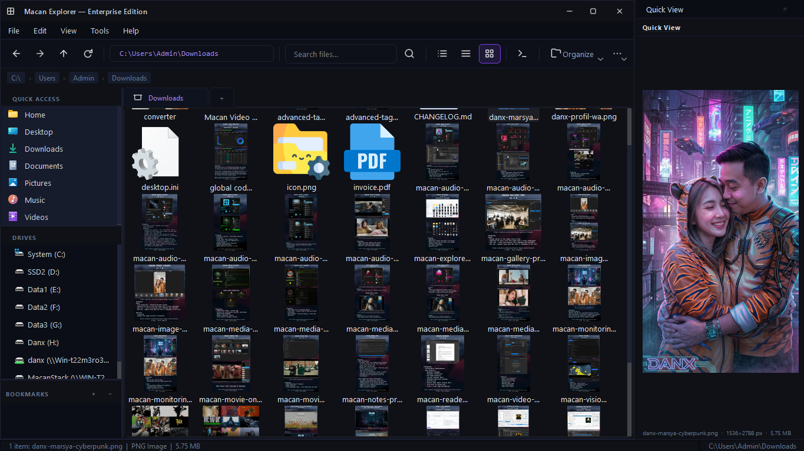
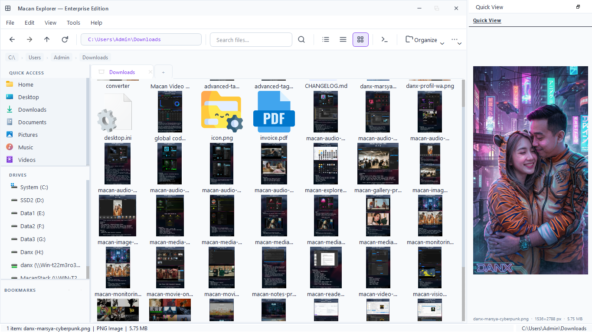
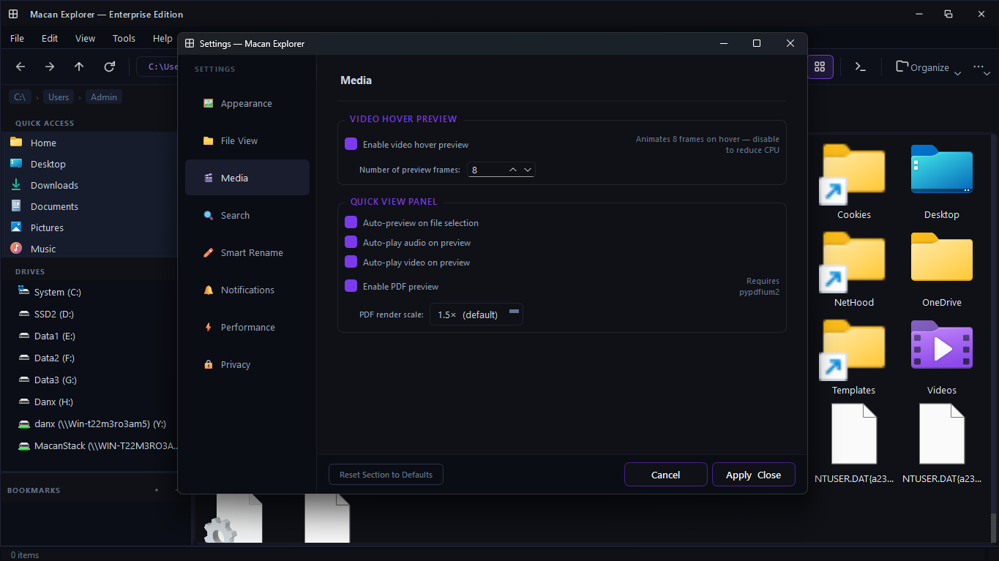

<div align="center">

# 🐅 Macan Explorer
### Enterprise Edition · v8.0.0

**A fast, keyboard-first file manager built with PySide6 for developers, creators, and power users.**


</div>

---

## Overview

Macan Explorer is an enterprise-grade file management application designed for users who need more than their operating system's default file browser. Built entirely in Python on top of the PySide6 / Qt6 framework, it delivers a clean frameless UI, multi-tab navigation, a powerful batch rename engine, a real-time activity log, and deep session persistence — all distributed as a small set of self-contained Python files.

Version 8.0 — *"Performance, Settings & Documentation"* — is an infrastructure release that benefits every existing feature. The folder media detection pipeline is rebuilt as a fully lazy, thread-safe background system that eliminates startup lag when browsing large drives. A comprehensive Settings dialog exposes every configurable parameter across eight categories. A searchable Help system ships 30 enterprise-grade articles covering every workflow in the application.

---

## ⚠️ Source Code Availability

> **Only versions 4.3.0 and 5.0.0 are publicly available** in this repository.
>
> Versions 6.0.0 and beyond are **closed-source** and not distributed.
> This README documents the current feature set for reference purposes.
> If you are looking to get started, download the latest open-source release from the
> [Releases](https://github.com/danx123/macan-explorer/releases) page.

---

## Table of Contents

- [Features](#features)
- [Screenshots](#screenshots)
- [Source Code Availability](#️-source-code-availability)
- [Requirements](#requirements)
- [Installation](#installation)
- [Running the Application](#running-the-application)
- [Usage Guide](#usage-guide)
- [Keyboard Shortcuts](#keyboard-shortcuts)
- [Configuration & Persistence](#configuration--persistence)
- [File Structure](#file-structure)
- [Architecture Overview](#architecture-overview)
- [Known Limitations](#known-limitations)
- [Credits](#credits)

---

## Features

### 🗂️ Navigation
- **Multi-tab browsing** — open as many directory tabs as needed; tabs are movable and closable
- **"+" tab button** — embedded directly in the tab bar, always adjacent to the last open tab
- **Tab context menu** — right-click any tab to close it or open its path in a new independent window
- **Breadcrumb navigation bar** — click any path segment to jump directly to that directory
- **Full history stack** — Back (`Alt+←`), Forward (`Alt+→`), Up (`Alt+↑`) with keyboard shortcuts
- **Address bar** — type or paste any path and press Enter to navigate instantly
- **Sidebar** with three independently resizable panels:
  - **Quick Access** — Home, Desktop, Downloads, Documents, Pictures, Music, Videos; OS-native icons via `QFileIconProvider`; right-click any entry → Properties
  - **Drives** — live drive tree with right-click → Drive Properties (disk usage, free space, progress bar)
  - **Bookmarks** — drag folders in or use the + button; supports drag-and-drop from the file view

### 📋 File Operations
- Copy, Cut, Paste with clipboard-style queue across folders and tabs
- Drag-and-drop between the file view and sidebar bookmark list
- **Move to Recycle Bin** (`Del`) — sends items to the OS Recycle Bin / Trash via `send2trash`; falls back to permanent delete with confirmation if trash is unavailable
- Rename (inline `F2`), New Folder (`Ctrl+Shift+N`), New File
- Select All (`Ctrl+A`)
- Multi-file operations with a progress dialog for large batches
- **Context menu** — full operation set with keyboard shortcut hints, plus:
  - **"🖼️ Set as Wallpaper"** — right-click any image file; cross-platform (Windows, macOS, Linux)
  - **"Folder Properties"** — right-click empty space; shows metadata for the currently open folder

### 🔍 View Modes
| Mode | Description |
|---|---|
| **Details** | Table view with name, size, type, and date columns; sortable headers; column widths persisted |
| **List** | Compact list view for dense directory browsing |
| **Icons** | Large icon grid with image thumbnails, video thumbnails, and folder media previews |

- View mode preference is persisted and restored per session

### 🖼️ Thumbnail Engine
- Instant image thumbnails for **PNG, JPG, JPEG, BMP, GIF, WEBP**
- Video thumbnails for **MP4, MKV, AVI, MOV, WEBM, FLV, WMV, MPG, MPEG** *(requires OpenCV)*
- **Folder media detection** — folders containing images or videos display a composite 2×2 grid preview; scans are deferred via `QTimer.singleShot` and performed by a dedicated `FolderThumbnailWorker` background thread pool — **no UI lag even on large drives**
- **Video hover preview** — hovering over a video shows a floating animated preview cycling 8 frames from the first 10 seconds; generated in a background thread
- Thumbnails generated off the main thread via `QThreadPool` (up to 4 concurrent workers)
- MD5-hashed disk cache stored in `~/.macan_explorer/thumbnails/`
- **Clear Thumbnail Cache** available in the toolbar More menu

### 👁️ Quick View Panel *(F3)*
A fully interactive media preview panel — no external application needed.

- Toggled via `F3` or View → Toggle Quick View; appears as a resizable dock on the right side
- Auto-previews whichever single file is selected in the active tab
- Panel width, visibility, and audio/video volume level persisted via QSettings

**Image viewer**
- Renders the image scaled to the panel width; re-scales live as the panel is resized
- Meta bar shows filename, pixel dimensions, and file size

**Text & code viewer**
- Monospaced reader with UTF-8 / Latin-1 auto-detection, truncated at 256 KB
- Supports 40+ extensions: `txt`, `md`, `log`, `json`, `yaml`, `toml`, `csv`, `xml`, `html`, `css`, `js`, `ts`, `py`, `java`, `c`, `cpp`, `h`, `rs`, `go`, `sh`, `bat`, `sql`, `rb`, `php` and more


**Audio player** *(requires `mutagen` + `PySide6-Addons`)*
- Formats: **MP3, FLAC, OGG, M4A, AAC, WAV, WMA, OPUS, AIFF**
- Cover art, title, artist, album; seek bar, position/duration labels, Play/Pause, volume slider

**Video player** *(requires `PySide6-Addons`)*
- Formats: **MP4, MKV, AVI, MOV, WEBM, FLV, WMV, MPG, MPEG**
- Embedded `QVideoWidget`; seek bar, Play/Pause, volume slider

**PDF viewer** *(requires `pypdfium2`)*
- Page-by-page rendering at 1.5× scale; ◀/▶ navigation; auto-rescale on resize

**Unsupported types** — "No preview available" with install instruction where applicable

### ⚙️ Settings *(Ctrl+,)* — **New in v8.0**
A full-featured settings dialog with eight categorised sections:

| Section | Controls |
|---|---|
| 🖼️ **Appearance** | Theme, sidebar visibility, status bar options |
| 📁 **File View** | Thumbnail toggles, folder detection on/off, detection delay, default view mode |
| 🎬 **Media** | Video hover frames, Quick View auto-play, PDF render scale |
| 🔍 **Search** | Default mode (Real-time / Manual), debounce delay |
| ✏️ **Smart Rename** | Confirm behaviour, live preview, rule persistence, max preview rows |
| 🔔 **Notifications** | Activity log event types, status bar messages |
| ⚡ **Performance** | Thread pool limits, cache size, lazy-load singleShot delay |
| 🔒 **Privacy** | Cache persistence, log file writing, path inclusion in logs |

Changes are written immediately to `ConfigManager` / `QSettings` and applied live on close.

### 📖 Help System *(F1)* — **New in v8.0**
A searchable, article-based help dialog with 30 articles across 9 sections:

- Getting Started (Welcome, Installation, Interface Overview)
- Navigation, File Operations, View Modes, Search, Quick View, Smart Rename
- Keyboard Shortcuts full reference, Settings overview, QSettings key reference
- Troubleshooting (7 documented issues with solutions)

Live search filters both article titles and full article body text with a 250 ms debounce.

### 🔎 Inline Search *(Ctrl+F)*
- Search bar appears **inside the current file view** — no separate dialog
- **Real-time** (300 ms debounce) or **Manual** mode via drop-down
- Scoped to the **current folder only** — direct children of the active path
- Live match counter; clears automatically on navigation; mode persisted via QSettings

### ✏️ Smart Rename *(Ctrl+R)*
A full-featured batch rename engine with live preview and undo support.

**Tab 1 — Find & Replace** — multi-pattern rules, prefix/suffix, case conversion, extension override, remove special chars, space replacement

**Tab 2 — Numbering** — auto-increment counter with configurable start, padding, and separator

**Tab 3 — Regex** — full Python `re` patterns with capture group substitution; enable/disable toggle

**Live Preview Table** — real-time updates; **Preview All** dialog; **Undo Last Rename** in one click.

> Smart Rename is hidden by default. Open with **Ctrl+R**.

### 📝 Activity Log
- Color-coded entries: `INFO`, `NAV`, `SUCCESS`, `ERROR`, `COPY`, `MOVE`, `RENAME`, `CREATE`, `DELETE`
- Every file operation logged automatically, including wallpaper changes
- **Export** to `.txt`, **Clear** with one click; monospaced auto-scroll view

### 🎨 Theme System
- **Dark** (default) and **Light** themes with purple accents (`#7C3AED`)
- All SVG icon strokes re-rendered per theme; window controls adapt to both
- Toggle with `Ctrl+D`; persisted across sessions

### 💾 Session Persistence (QSettings)
Window geometry, dock layout, main splitter width, column widths, sort state, Smart Rename fields and active tab, search mode, volume level, view mode, hidden files toggle, theme, and bookmark list — all persisted automatically.

### 🖥️ Terminal Integration
**Open Terminal Here** (`Ctrl+T`) — auto-detects `cmd.exe` (Windows), `Terminal.app` (macOS), or `gnome-terminal / xterm / konsole / xfce4-terminal / lxterminal` (Linux).

### 🪟 Multi-Window
`Ctrl+N` opens a new independent window. Tab context menu → **Open in New Window** opens the tab's current path in a new window.

---

## Screenshots

| Dark Theme | Light Theme |
|---|---|
|  |  |

---
| Settings |
|---|
|  |

---

## Requirements

### Required
| Dependency | Version | Purpose |
|---|---|---|
| Python | 3.10+ | Runtime |
| PySide6 | 6.x | Qt6 bindings (widgets, core, GUI, SVG) |

### Optional
| Dependency | Version | Purpose |
|---|---|---|
| `opencv-python` | 4.x+ | Video thumbnails, video hover preview |
| `send2trash` | 1.8+ | Move deleted files to OS Recycle Bin / Trash |
| `mutagen` | 1.45+ | Audio metadata and cover art extraction |
| `pypdfium2` | 4.x+ | PDF page rendering in Quick View |
| `PySide6-Addons` | 6.x | Audio and video playback (`QtMultimedia`) |

> All optional packages degrade gracefully — the application starts without any of them and shows clear in-panel messages with install instructions where needed.

---

## Installation

### 1. Clone or download

```bash
git clone https://github.com/danx123/macan-explorer.git
cd macan-explorer
```

> **Note:** Only `v4.3.0` and `v5.0.0` source files are available in this
> repository. Download the appropriate release from the
> [Releases](https://github.com/danx123/macan-explorer/releases) page.

### 2. Create a virtual environment *(recommended)*

```bash
python -m venv venv

# Windows
venv\Scripts\activate

# macOS / Linux
source venv/bin/activate
```

### 3. Install dependencies

**Minimum (core features only):**
```bash
pip install PySide6
```

**Recommended (most features):**
```bash
pip install PySide6 opencv-python send2trash mutagen pypdfium2
```

**Full install (including audio/video playback):**
```bash
pip install PySide6 opencv-python send2trash mutagen pypdfium2
pip install PySide6-Addons   # provides QtMultimedia for playback
```

---

## Running the Application

All three files must be in the same directory:

```bash
python macan_explorer.py
```

No build step, no resource compilation, no installer required.

---

## Usage Guide

### Basic Navigation

| Action | How |
|---|---|
| Open a folder | Double-click it in the file view |
| Go back / forward | `Alt+←` / `Alt+→` or toolbar buttons |
| Go up one level | `Alt+↑` or the up button |
| Navigate via address bar | Type a path, press `Enter` |
| Navigate via breadcrumb | Click any segment |
| Open in a new tab | Right-click folder → Open in New Tab, or click `+` |
| Open in a new window | Right-click tab → Open in New Window |

### File Operations

| Action | Shortcut |
|---|---|
| Copy | `Ctrl+C` |
| Cut | `Ctrl+X` |
| Paste | `Ctrl+V` |
| Rename | `F2` |
| Move to Recycle Bin | `Del` |
| Select All | `Ctrl+A` |
| New Folder | `Ctrl+Shift+N` |
| Folder Properties | Right-click empty space → Folder Properties |
| Set as Wallpaper | Right-click image file → Set as Wallpaper |

### Quick View — Media Playback

1. Press `F3` to open the Quick View panel.
2. Select a single file — preview loads automatically.
3. **Audio/Video** — click `▶` to play; click seek bar to jump; drag volume bar to adjust.
4. **PDF** — use `◀` / `▶` to navigate pages.
5. Resize the panel by dragging its left edge.

### Inline Search

1. Press `Ctrl+F` — search bar opens inside the current file view.
2. Choose **Real-time** or **Manual** mode.
3. Type your query — only items in the **current folder** are filtered.
4. Press `Esc` or `✕` to close.

### Settings

Press `Ctrl+,` or go to **Tools → Settings**. Changes apply immediately — no restart required.

### Help

Press `F1` or go to **Help → Help** for searchable documentation covering every feature.

### Smart Rename Workflow

1. Navigate to the target folder; optionally select specific files.
2. Press `Ctrl+R` to open the Smart Rename panel.
3. Configure rules across the three tabs; watch the **Live Preview** update.
4. Click **Preview All** → **Apply Rename** to commit.
5. Click **Undo Last Rename** to reverse if needed.

### Bookmarks

- **Add:** Drag a folder onto the Bookmarks list, or click `+` and browse.
- **Remove:** Select a bookmark and click `−`.
- **Navigate:** Click any bookmark to open it in the current tab.

---

## Keyboard Shortcuts

### Navigation
| Shortcut | Action |
|---|---|
| `Alt+←` | Go back |
| `Alt+→` | Go forward |
| `Alt+↑` | Go up one directory |
| `F5` | Refresh current view |
| `Ctrl+Tab` | Open new tab |
| `Ctrl+N` | Open new window |

### File Operations
| Shortcut | Action |
|---|---|
| `Ctrl+C` | Copy selected items |
| `Ctrl+X` | Cut selected items |
| `Ctrl+V` | Paste |
| `Ctrl+A` | Select all |
| `F2` | Rename selected item |
| `Del` | Move to Recycle Bin |
| `Ctrl+Shift+N` | Create new folder |

### Application
| Shortcut | Action |
|---|---|
| `Ctrl+R` | Open Smart Rename panel |
| `Ctrl+F` | Open inline search bar |
| `F3` | Toggle Quick View panel |
| `Ctrl+,` | Open Settings |
| `F1` | Open Help |
| `Ctrl+T` | Open terminal in current directory |
| `Ctrl+D` | Toggle Dark / Light theme |
| `Ctrl+H` | Toggle show / hide hidden files |

---

## Configuration & Persistence

### Application data — `~/.macan_explorer/`
```
~/.macan_explorer/
├── macan_explorer_config.json   # Bookmarks, view mode, theme, settings flags
├── thumbnails/                  # MD5-hashed video thumbnail cache
└── logs/
    ├── shrine_ritual_log.txt    # General log (rotating, max 1 MB × 5 backups)
    └── error_log.txt            # Error-only log (rotating, max 1 MB × 5 backups)
```

### QSettings — OS native store

| Platform | Location |
|---|---|
| Windows | `HKEY_CURRENT_USER\Software\Macan Angkasa\Macan Explorer` |
| macOS | `~/Library/Preferences/com.macan-angkasa.Macan Explorer.plist` |
| Linux | `~/.config/Macan Angkasa/Macan Explorer.ini` |

To reset all session state, delete the relevant QSettings key or file.

---

## File Structure

```
macan_explorer.py         # Core application          (~5,529 lines)
explorer_settings.py      # Settings dialog module    (~741 lines)
explorer_help.py          # Help system module        (~808 lines)
screenshot/
├── dark.png              # Dark theme screenshot
└── light.png             # Light theme screenshot
CHANGELOG.md
README.md
```

> All three `.py` files must reside in the same directory.
> `explorer_settings` and `explorer_help` are imported lazily and do not
> affect startup time when not in use.

### Internal Module Layout

```
macan_explorer.py
│
├── SVG_ICONS / _ICON_COLORS       Embedded icons + per-theme stroke colors
├── create_icon()                  Render SVG → QIcon with theme color
├── DARK_THEME_QSS / LIGHT_THEME_QSS
│
├── WorkerSignals         QObject    Shared signal class for thread workers
├── FolderSizeWorker      QRunnable  Async folder size calculation
├── FolderThumbnailWorker QRunnable  Lazy folder media scan (paths only, no Qt) ★ v8
├── ThumbnailWorker       QRunnable  Async video thumbnail generation (OpenCV)
├── VideoPreviewWorker    QRunnable  Async video frame extraction for hover preview
│
├── ErrorHandler                     Structured error capture
├── ShrineLogger                     Rotating file logger
├── ActivityLog                      In-app log with color-coded severity levels
├── ConfigManager                    JSON-backed user config + feature flags
│
├── ThumbnailIconProvider  QFileSystemModel   Lazy folder + image + video thumbnails
├── SortFilterProxyModel   QSortFilterProxyModel   Scoped search + hidden-file filter
│
├── BreadcrumbBar      QWidget    Clickable path segment bar
├── CommandBar         QToolBar   Toolbar + theme-aware icon re-rendering
├── VideoHoverPreview  QLabel     Floating animated video hover overlay
├── FileView           QWidget    Core browser: tree/list/icons, inline search,
│                                 wallpaper, folder properties context menus
│
├── Sidebar            QWidget    QSplitter [QuickAccess | Drives | Bookmarks]
├── TabManager         QWidget    QTabWidget + "+" dummy tab + context menu
├── TitleBar           QWidget    Frameless titlebar + theme-aware controls
│
├── DrivePropertiesDialog / PropertiesDialog / OperationProgressDialog
├── RenameRule / SmartRenameEngine / RenamePreviewDialog
├── SmartRenameDock    QWidget    3-tab rename UI + live preview
├── AboutDialog        QDialog
├── QuickViewPanel     QWidget    Image / text / audio▶ / video▶ / PDF📄
├── ActivityLogDock    QWidget    Dockable activity log
└── MainWindow         QMainWindow  Root: menu, layout, QSettings, signals

explorer_settings.py
└── SettingsDialog     QDialog    8-section settings UI (lazy import)

explorer_help.py
└── HelpDialog         QDialog    30-article searchable help (lazy import)
```

*★ new in v8.0.0*

---

## Architecture Overview

Macan Explorer follows a **signal-driven MVC-like pattern**:

- **Model layer:** `ThumbnailIconProvider` (extends `QFileSystemModel`) is the single source of truth; `SortFilterProxyModel` handles sorting, hidden-file filtering, and scoped search. Folder thumbnail detection is now fully lazy and thread-safe — a `QTimer.singleShot` debounce gate triggers `FolderThumbnailWorker` which collects file paths in the background; all Qt painting happens on the main thread in `_on_folder_thumb_done`.
- **View layer:** `FileView` renders the model in three switchable modes; `QuickViewPanel` previews the selected file with full media playback.
- **Controller layer:** `MainWindow` wires all signals into coordinated actions. Settings changes propagate via cache clears and tab refreshes.
- **Worker threads:** `FolderSizeWorker`, `FolderThumbnailWorker`, `ThumbnailWorker`, and `VideoPreviewWorker` run in dedicated `QThreadPool` instances; all results are delivered to the main thread via signals.
- **Persistence:** `QSettings` (session state) + `ConfigManager` JSON (bookmarks, feature flags, preferences).
- **Modules:** `explorer_settings` and `explorer_help` are lazily imported to avoid startup overhead.

```
MainWindow
 ├── TitleBar              ← frameless controls, theme-aware icons
 ├── CommandBar            ← toolbar, address bar, search
 ├── BreadcrumbBar         ← path segments → navigate
 ├── Sidebar               ← QSplitter [QuickAccess | Drives | Bookmarks]
 ├── TabManager            ← n × FileView + "+" tab + context menu
 │    └── FileView         ← ThumbnailIconProvider + SortFilterProxyModel
 │         ├── InlineSearchBar        ← real-time / manual scoped filter
 │         └── VideoHoverPreview      ← floating frame-animation overlay
 ├── ActivityLogDock       ← QDockWidget, bottom, lazy-loaded
 ├── SmartRenameDock       ← QDockWidget, bottom, tabified
 └── QuickViewDock         ← QDockWidget, right, lazy-loaded
      └── QuickViewPanel   ← image / text / audio▶ / video▶ / PDF📄

[Ctrl+,] → explorer_settings.SettingsDialog   (lazy import)
[F1]     → explorer_help.HelpDialog           (lazy import)
```

---

## Known Limitations

- **Single-pane layout** — dual-pane (commander-style) browsing is not available.
- **Local filesystem only** — no network, FTP, or cloud path support.
- **Video thumbnails & hover preview require OpenCV** — generic icon shown otherwise.
- **Audio/video playback requires PySide6-Addons** — panel shows install instructions otherwise.
- **PDF preview requires pypdfium2** — panel shows install instructions otherwise.
- **Recycle Bin on network drives** — `send2trash` may fall back to permanent deletion on certain network or Linux configurations.
- **Smart Rename undo** — covers only the most recent batch; general filesystem undo is not implemented.
- **Inline search** — current folder only; recursive subdirectory search not yet available.

---

## Changelog

See [CHANGELOG.md](CHANGELOG.md) for the full version history.

**v8.0.0 highlights:** Lazy thread-safe folder detection (`FolderThumbnailWorker` + `QTimer.singleShot`), Settings dialog (`Ctrl+,`, 8 sections, 741 lines), Help system (`F1`, 30 articles, 808 lines), 4 bug fixes including illegal Qt painting from worker thread.

**v7.5.0 highlights:** Audio/video playback in Quick View, PDF rendering, Set as Wallpaper, Folder Properties context menu.

**v6.5.0 highlights:** Tab close button fix, tab context menu, QSettings full persistence (column widths, sort, volume).

**v6.0.0 highlights:** Inline scoped search, "+" tab, Quick View panel, folder thumbnails, video hover, Recycle Bin.

**v5.0.0 / v4.3.0:** *(Source available)* — see Releases page.

---

## Credits

**Developer:** Danx Exodus  
**Organization:** Macan Angkasa  
**Repository:** [github.com/danx123/macan-explorer](https://github.com/danx123/macan-explorer)  
**Built with:** [Python](https://python.org) · [PySide6 / Qt6](https://doc.qt.io/qtforpython/) · [OpenCV](https://opencv.org) · [send2trash](https://github.com/arsenetar/send2trash) · [mutagen](https://github.com/quodlibet/mutagen) · [pypdfium2](https://github.com/pypdfium2-team/pypdfium2)

Portions of the Smart Rename engine and Activity Log were adapted from the **SmartFileManager** project (internal, same author).

---

<div align="center">

*Copyright © 2026 Macan Angkasa. All rights reserved.*

</div>
